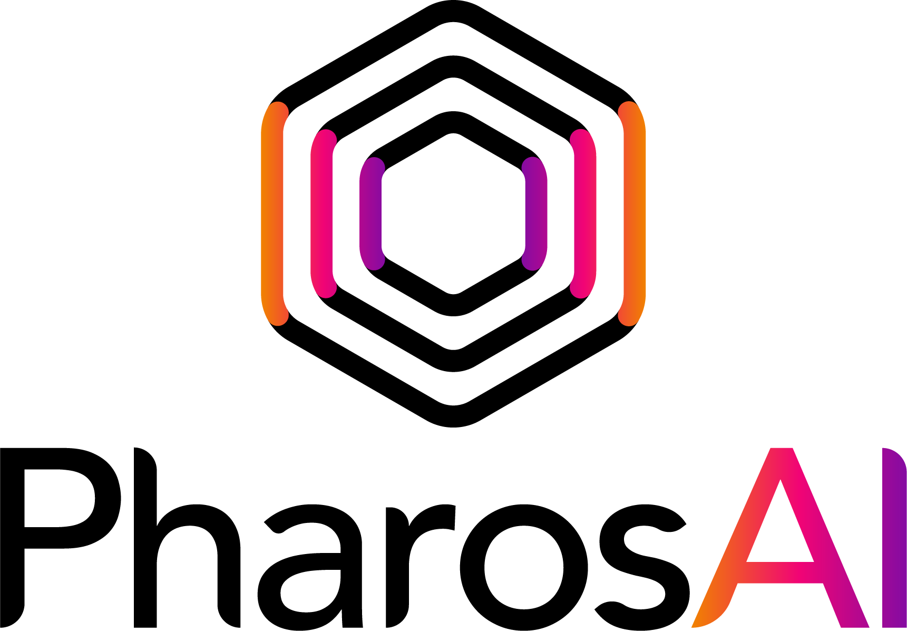

<p align="center">
  
</p>

## Overview

PharosAI is a platform dedicated to navigating the path to AI-assisted healthcare. This repository contains the source code for the PharosAI landing page, showcasing our mission to revolutionize healthcare with AI.

## Getting Started

### Prerequisites

Ensure you have the following installed:

- Git
- Node.js and npm
- Heroku CLI

### Installation

1. Clone the repository:

```bash
git clone https://github.com/PharosKCL/PharosAI.git
cd PharosAI
```

2. Install dependencies:

```bash
npm install
```

### Running Locally
To run the website locally, open index.html in your web browser or use a local server like http-server

```bash
npx http-server
```

### Deployment
Deploy the website to Heroku:
```bash
heroku login
heroku create
git push heroku main
```

### Contact
For any inquiries, please contact: gregory.verghese@pharosai.co.uk

